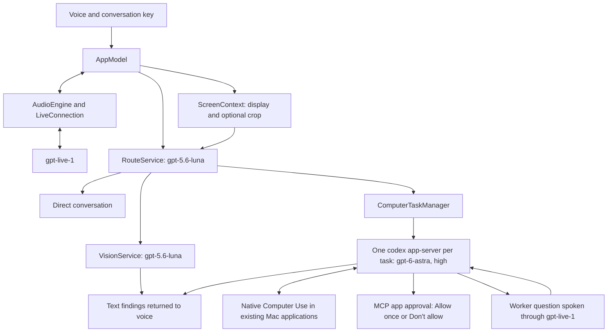

# Computah architecture and maintenance

Computah is a native macOS 14 or later executable built with Swift Package Manager, SwiftUI, and AppKit. There are no declared third-party package dependencies. The app coordinates remote model requests and local Codex worker processes; the models do not run on the Mac.

[Demo site](https://computah.anselmlong.com) · [Demo video](https://youtu.be/WGbVYat8Lmg) · [Project overview](README.md)

## How we built it

Computah has three independent lifecycles: the native companion, a voice conversation, and computer tasks. `AppModel` coordinates them on the main actor. SwiftUI observes state while AppKit owns window placement.

1. **Start with the Mac interaction.** An accessory app hosts a borderless notch panel. A right-modifier event tap supports talking and lasso selection without taking over the user's pointer.
2. **Connect voice and screen context.** AVFoundation converts microphone input to 24 kHz PCM and plays streamed responses. ScreenCaptureKit captures the display under the pointer. Routing runs after a short transcript pause and chooses conversation, vision, computer work, or showing a task.
3. **Start a normal Codex worker for each task.** The task manager launches `codex app-server` under the user's normal Codex home, signed-in account, configuration, and plugins. The worker requests `gpt-6-astra` with high reasoning effort and uses native Computer Use in the user's existing applications.
4. **Keep questions with the right task.** Generation identifiers reject stale callbacks after cancellation. Task batches return bounded text summaries to the originating voice session. When a worker asks for information or confirmation, the voice layer asks the user and returns the actual answer to that same waiting app-server turn.
5. **Package the app and site together.** Swift Package Manager builds the app. Tagged releases package the app and matching static website download with a checksum manifest. Legacy fixture scripts can still render the illustrative browser screenshots used by the demo site; they are not the current task runtime.

## Why these choices

| Decision | Benefit | Tradeoff |
| --- | --- | --- |
| SwiftUI and AppKit | Native audio, permissions, windows, and notch interaction | macOS only |
| Separate voice, routing, and task models | Conversation can continue during longer computer work | Multiple remote requests and network latency |
| One Codex process per task | Independent reasoning and cancellation | Process and account usage grows with tasks |
| Existing Codex account and plugins | Native apps work through the same configuration as Codex | Tasks share the user's applications and signed-in state |
| YOLO worker mode | Native tools can run without repeated runtime command approvals | The runtime does not enforce the confirmation instruction |
| Static website with no frontend build | Simple deployment and accessible HTML fallback | Public documentation must be maintained alongside repository guides |

## Request flow

The model names above are configured identifiers in this repository, not a claim that every account has access to them.

When a new utterance arrives, the app attempts to capture the display under the pointer. Routing waits for a brief transcript pause, then classifies the request using conversation context and available screenshots. It chooses direct conversation, screen interpretation, a new computer task, or showing an existing task. Screen interpretation produces text for the voice session.

Ending voice cancels screen analysis and clears the selection while computer tasks continue. Each task retains its own status and result. Quitting or reopening the app stops all workers; ephemeral threads are not restored after relaunch.

## Worker environment and approvals

Each task uses a regular `codex app-server` process. It inherits the user's `HOME`, `CODEX_HOME`, signed-in account, configuration, and installed plugins. Computah removes variables that identify the parent Codex task and never passes the OpenAI API key saved for voice and screen reading.

The worker starts an ephemeral thread in YOLO mode with approval policy `never` and sandbox mode `danger-full-access`. This gives the normal Codex tool runtime broad access as the current user. The base instructions prohibit credential collection and require explicit user confirmation before sending, submitting, paying, publishing, accepting terms, or finalizing an application. That behavior is a model instruction and question-routing mechanism, not a security boundary enforced by the sandbox or approval policy.

Native Computer Use may emit an MCP elicitation request before accessing an app. Computah holds that JSON-RPC request and shows **Allow once** and **Don't allow** in the task card. It sends the user's choice over the same app-server connection, allowing the turn to continue. These native app and plugin gates remain active in YOLO mode.

An `item/tool/requestUserInput` request also keeps the app-server connection and turn alive. The installed `default_mode_request_user_input` feature is enabled so normal working-mode tasks can issue these requests. Computah queues non-secret questions, identifies the originating task, and asks them through the active `gpt-live-1` conversation. A routing call classifies the user's next complete utterance as an answer, unrelated speech, or ambiguous speech. Only the user's actual answer is returned to the matching task and question IDs. Unrelated speech continues through normal conversation. Ambiguous speech causes the question to be asked again.

The task card also renders every pending request as a text form, including fixed choices and optional free-form answers. Secret questions use private text fields and never enter voice transport. This fallback works without an active voice conversation.

Computer Use operates the user's existing applications and signed-in sessions. Tasks do not receive isolated browser profiles or desktops. Fresh native observation and actions are serialized, but the user and concurrent workers can still affect the same applications.

Earlier builds called the protected Computer Use helper directly and received caller-authentication error `-10000`. Starting a normal Codex worker removes that unsupported direct-helper route.

## Code map

Paths below are relative to `Sources/Computah/`.

| File | Responsibility |
| --- | --- |
| `main.swift`, `Panel.swift`, `NotchGeometry.swift` | App startup, notch placement, conversation, settings, and task controls |
| `AppModel.swift` | Conversation state, routing, screen analysis, task batches, and result delivery |
| `AudioEngine.swift` | Microphone conversion, echo cancellation with fallback, and audio playback |
| `LiveConnection.swift`, `Protocol.swift` | Voice WebSocket lifecycle, bounded send queue, protocol messages, and transcript ledger |
| `Routing.swift` | Structured request classification and Responses transport |
| `ScreenContext.swift` | ScreenCaptureKit screenshots, optional crop, and vision findings |
| `ComputerTask.swift` | Independent task lifecycle, cancellation, app approvals, worker questions, results, and manual review |
| `CodexWorker.swift` | CLI discovery, inherited process environment, app-server JSON-RPC, approvals, questions, and results |
| `BrowserWorkspace.swift`, `CodexComputerUseClient.swift` | Native Computer Use coordination retained by the task layer |
| `Hotkey.swift`, `Permissions.swift` | Configurable right-modifier gesture, selection overlay, and permission state |
| `KeychainCredentialStore.swift` | Voice and screen-reading API key persistence through macOS Keychain |

## Data boundaries

The voice connection sends microphone audio to OpenAI. Routing and vision can send the full captured display plus a selected crop; selecting a region does not limit transmission to that crop. Computah excludes its own windows from display capture. A crop remains selected until cleared or voice ends, while later utterances can refresh the full-display image.

Computer task observations and actions pass through the user's signed-in Codex account and native apps. A task can encounter content from unrelated windows because it shares the desktop. Do not delegate sensitive work while unrelated private information is visible.

## Build and validation

Use `swift build` for compilation and `swift test` for the test suite. Current results belong in [docs/VALIDATION.md](docs/VALIDATION.md), including failures or skipped coverage.

`zsh scripts/build.sh` builds release output, creates a staged app from `Resources/Info.plist`, stamps its local build number and UTC date, signs and verifies it, then replaces `dist/Computah.app`. With `COMPUTAH_NOTARY_PROFILE`, it also submits the app for notarization, staples the ticket, and checks Gatekeeper before publishing the staged bundle. It preserves the previous bundle if staging, signing, or notarization fails.

The `Check and release` workflow runs CI on a hosted Mac. Successful pushes to `main` deploy the website from a hosted Linux runner, preserving the current app archive and verifying site checksums. Version tags use the private repository's personal Mac runner to package, deploy, verify the public download, and install/open the same bundle. Website source lives in `website/`. See [RELEASES.md](RELEASES.md) for the deployment boundary and rollback limitations.

The optional `zsh scripts/audio-smoke-test.sh` uses the microphone and audio output. The legacy `zsh scripts/run-browser-research-smoke.sh` and pitch-preview scripts exercise the retired WebKit fixture path and do not validate the current native Computer Use worker.

## Remaining production work

The current implementation is a hackathon prototype. Before a broad release, complete an authenticated voice-and-vision rehearsal on the supported Mac/device matrix and a full native Computer Use task after accepting app access. Long-running use also needs task dismissal, resource limits, and a worker deadline.

Explicit confirmation before consequential actions is an instruction to an agent running with broad local access. Computah can carry the worker's question and user's answer across the live voice session, but a stronger release would enforce that policy below the model layer. See [data and limits](docs/PRIVACY.md) and the [validation record](docs/VALIDATION.md).

## Keeping documentation current

Update documentation in the same change as the behavior it describes:

| Change | Documentation to maintain |
| --- | --- |
| Setup, CLI discovery, signing, permissions, or troubleshooting | `docs/SETUP.md` and `website/docs.html` |
| User capabilities, task lifecycle, or product constraints | `PRODUCT.md` and affected README usage notes |
| Visible controls, subtitles, layout, shortcuts, or accessibility | `DESIGN.md` and affected README usage notes |
| Module responsibilities, model routing, tools, or data flow | `ARCHITECTURE.md` and README data/model tables |
| Validation or release preparation | `docs/VALIDATION.md` with date, source revision, commands, and actual results |

Describe implemented behavior and label unverified behavior explicitly. Keep source compilation, automated tests, hardware checks, and authenticated end-to-end validation distinct. Do not carry a previous passing test count forward as evidence for a new revision.
