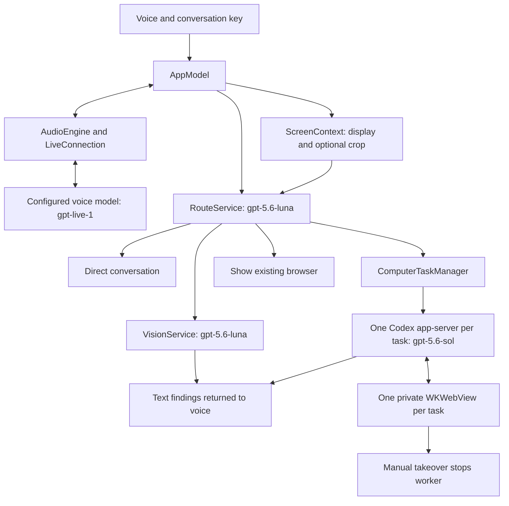

# Computah architecture and maintenance

Computah is a native macOS 14+ executable built with Swift Package Manager, SwiftUI, and AppKit. There are no declared third-party package dependencies. The app coordinates remote model requests and local browser worker processes; the models do not run on the Mac.

## Request flow

The model names above are configured identifiers in this repository, not a claim that every API account has access to them.

When a new utterance arrives, the app attempts to capture the display under the pointer. Routing waits for a brief transcript pause, then classifies the request using conversation context and available screenshots. It chooses direct conversation, screen interpretation, independent browser work, or showing an existing browser. Screen interpretation produces text for the voice session. Independent jobs receive separate browser sessions and worker processes; dependent steps stay in one task.

Ending voice cancels screen analysis and clears the selection while browser tasks continue. Each task retains its own status and result. Watching or closing a browser window leaves work running. Taking over stops that worker and enables manual interaction. Quitting or reopening the app stops all workers; sessions are not restored after relaunch.

## Code map

Paths below are relative to `Sources/Computah/`.

| File | Responsibility |
| --- | --- |
| `main.swift`, `Panel.swift` | App startup, notch window, conversation, settings, and task controls |
| `AppModel.swift` | Conversation state, routing, screen analysis, task batches, and result delivery |
| `AudioEngine.swift` | Microphone conversion, echo cancellation with fallback, and audio playback |
| `LiveConnection.swift`, `Protocol.swift` | Voice WebSocket lifecycle, bounded send queue, protocol messages, and transcript ledger |
| `Routing.swift` | Structured request classification and Responses transport |
| `ScreenContext.swift` | ScreenCaptureKit screenshots, optional crop, and vision findings |
| `ComputerTask.swift` | Independent task lifecycle, cancellation, results, and manual takeover |
| `CodexWorker.swift` | CLI discovery, isolated process environment, JSON-RPC, and browser tool dispatch |
| `BrowserWorkspace.swift`, `BrowserWindow.swift` | Private WebKit session, browser tools, navigation restrictions, and watch/review window |
| `Hotkey.swift`, `Permissions.swift` | Configurable right-modifier gesture, selection overlay, and permission state |
| `KeychainCredentialStore.swift` | API key persistence through macOS Keychain |

## Data and execution boundaries

The voice connection sends microphone audio to OpenAI. Routing and vision can send the full captured display plus a selected crop; selecting a region does not limit transmission to that crop. Computah excludes its own windows from display capture. A crop remains selected until cleared or voice ends, while later utterances can refresh the full-display image.

Each browser task uses a nonpersistent WebKit data store and a Codex process with temporary home, configuration, and working directories. The app supplies its API key to that process and enables live web search for public website discovery while disabling built-in execution, apps, and other host capabilities. The process requests a read-only sandbox. These are application-level restrictions and requested sandbox settings, not proof of complete system isolation.

The custom OpenAI provider explicitly enables `supports_standalone_web_search`; Codex models using Responses Lite need that capability as well as `web_search="live"`. Search events are permitted; native execution events still stop the worker.

The worker searches for exact organizations and programs, verifies official sources, and opens discovered URLs in the browser. Page observations include visible link destinations to avoid guessed deep links. Private application details must not enter public search queries.

The six supplied tools navigate, observe, click, type, scroll, and request review. Preparation disables website JavaScript and blocks form submissions, non-GET navigation, and recognized action controls. This limits compatibility with scripted sites and cannot guarantee every GET destination is harmless. Manual review enables website JavaScript for subsequent navigation; it does not automatically reload or submit.

## Build and validation

Use `swift build` for compilation and `swift test` for the test suite. Tests include local WebKit fixtures and a Codex handshake with a dummy credential; they do not establish authenticated model behavior. The installed-CLI handshake test skips when no executable is found. Current observed results belong in the README's Verification section, including failures or skipped coverage.

`zsh scripts/build.sh` builds release output, creates a staged app from `Resources/Info.plist`, stamps its local build number and UTC date, signs and verifies it, then replaces `dist/Computah.app`. It chooses an existing signing identity or uses `COMPUTAH_SIGNING_IDENTITY`. It preserves the previous bundle if staging or signing fails. It does not run tests or notarize the app. `dist/` and `.build/` are ignored by Git.

The optional `zsh scripts/audio-smoke-test.sh` uses the microphone and audio output. Run it only when hardware testing is intended. It is separate from compilation and automated unit tests.

The `Check and release` workflow runs CI on a hosted Mac. Version tags then use the private repository’s personal Mac runner to package, deploy, verify the public download, and install/open the same bundle. Website source lives in `website/`. See [RELEASES.md](RELEASES.md) for the deployment boundary and rollback limitations.

## Keeping documentation current

Update documentation in the same change as the behavior it describes:

| Change | Documentation to maintain |
| --- | --- |
| Setup, CLI discovery, signing, permissions, or troubleshooting | `README.md` |
| User capabilities, task lifecycle, or product constraints | `PRODUCT.md` and affected README usage notes |
| Visible controls, subtitles, layout, shortcuts, or accessibility | `DESIGN.md` and affected README usage notes |
| Module responsibilities, model routing, tools, or data flow | `ARCHITECTURE.md` and README data/model tables |
| Validation or release preparation | README Verification section with date, source revision, commands, and actual results |

Describe implemented behavior and label unverified behavior explicitly. Keep source compilation, automated tests, hardware checks, and authenticated end-to-end validation distinct. Do not carry a previous passing test count forward as evidence for a new revision, or predict a shared release number from the local bundle counter.
