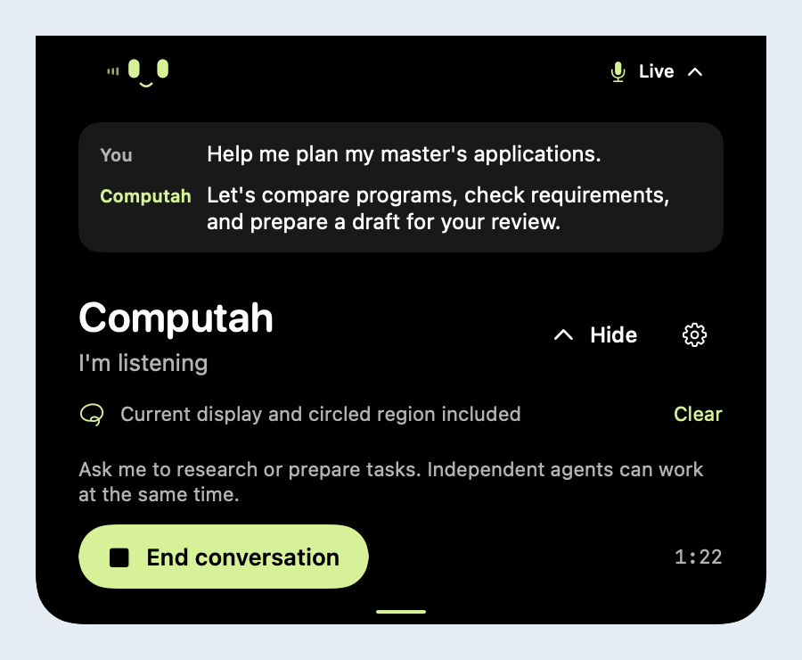

# Computah


**Talk about your screen. Hand off the browser work. Keep using your Mac.**

Computah is a native macOS voice companion that lives in your notch. Ask about what you see, circle something to give it context, and delegate research or preparation to independent browser workers—all while your own pointer and apps stay available.

[Live demo site](https://computah.anselmlong.com) · [Watch the demo](https://youtu.be/WGbVYat8Lmg) · [Setup guide](docs/SETUP.md) · [Architecture](ARCHITECTURE.md)



*Real SwiftUI interface; the screenshot uses illustrative conversation data. Watch the linked video for the demo recording.*

## Why we built it

Complex personal projects spill across tabs, notes, and half-finished forms. A master's application, for example, means researching programs, understanding requirements, and preparing details before you can make a decision. Computah brings the conversation and the browser work together in a small, persistent place on your Mac.

The interaction is simple: **talk, point, delegate, review.**

- **Talk naturally.** Tap Right Shift to start or end a voice conversation.
- **Point at context.** Hold the conversation key and circle a region, then ask about it.
- **Delegate independent jobs.** Each browser task gets its own session and local worker. Ending voice leaves those tasks running.
- **Keep the final say.** Watch a task's browser, then take over to review. Taking over stops the worker before manual interaction.

## Try it

Download the Mac prototype from the [demo site](https://computah.anselmlong.com), or build from source:

```sh
zsh scripts/build.sh
open dist/Computah.app
```

You need macOS 14+, a Swift toolchain, and an existing signing identity for the default build. For local development without a certificate, use `COMPUTAH_SIGNING_IDENTITY=- zsh scripts/build.sh`. The website download targets Apple silicon.

Open the notch panel's settings, add your OpenAI API key, and grant Microphone, Screen Recording, and Input Monitoring access as needed. Browser work also requires a compatible Codex CLI. The configured models are `gpt-live-1`, `gpt-5.6-luna`, and `gpt-5.6-sol`; your API account must have access. API usage is billed to that account. See the [full setup and troubleshooting guide](docs/SETUP.md).

## How it works

| Layer | What we built |
| --- | --- |
| Native companion | SwiftUI views in an AppKit notch panel; no Dock icon or separate menu bar item |
| Voice | AVFoundation audio capture/playback and a WebSocket connection to `gpt-live-1` |
| Screen understanding | ScreenCaptureKit captures the current display and optional crop; `gpt-5.6-luna` routes requests and interprets images |
| Browser workers | One local `codex app-server` process requesting `gpt-5.6-sol` per independent task |
| Review | A separate nonpersistent `WKWebView` per task, with six browser tools and manual takeover |
| Delivery | Swift Package Manager, hosted Mac CI, and a tagged app/site release pipeline |

The models run remotely. The Mac hosts the interface, capture, audio, browser sessions, and worker processes. Vision returns text findings to the voice session. The [architecture guide](ARCHITECTURE.md) includes the request flow, code map, and implementation tradeoffs.

## Demo scope

Built for a hackathon, this is an early prototype with a working native implementation and automated coverage—not a notarized production release. Browser preparation disables website JavaScript and blocks form submission, non-GET navigation, and recognized consequential controls. Modern portals, sign-in, uploads, and final submission can require manual interaction. Native desktop automation is outside this version's scope.

The API key is stored in macOS Keychain. Audio and available screen images can be sent to OpenAI; circling a region does **not** limit sharing to that crop. Task browsers are separate from your usual browser profile. Read [data and limits](docs/PRIVACY.md) before using sensitive content.

## Documentation

| Guide | Purpose |
| --- | --- |
| [Demo walkthrough](docs/DEMO.md) | Short pitch, presenter script, rehearsal, and fallback |
| [Setup and usage](docs/SETUP.md) | Build, credentials, permissions, controls, troubleshooting |
| [Architecture](ARCHITECTURE.md) | How we built it, data flow, modules, and tradeoffs |
| [Product](PRODUCT.md) / [Interface](DESIGN.md) | Implemented scope and native design |
| [Validation record](docs/VALIDATION.md) | Dated evidence, test commands, and remaining coverage |
| [Releases](RELEASES.md) | Packaging, signing, deployment, and rollback |
| [Website](website/README.md) | Static site development and public documentation |

Run `swift build`, `swift test`, and `python3 -m unittest discover -s scripts/tests -v` before releasing. Keep validation results tied to the revision tested; the demo checklist records what still needs a live rehearsal.
